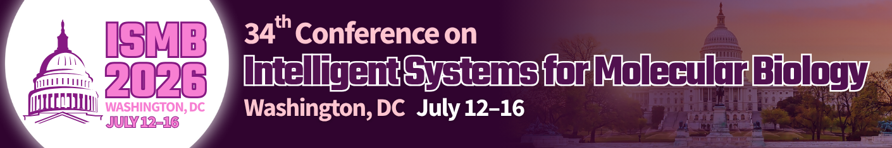

Quantum Computing for Multi-omics Analyses (ISMB 2026)
=========================================

**ISMB 2026 Tutorial — Washington, DC (July 12, 2026)**

An in-depth, hands-on tutorial exploring how quantum computing enables advanced multi-omics analysis and hybrid ML workflows.

----

Overview
--------

Join us for an interactive full-day tutorial covering the foundations and applications of **quantum computing (QC)** in **multi-omics data analysis**.

Participants will:

- Learn how to preprocess and encode biological data for quantum algorithms
- Explore **quantum machine learning (QML)** and hybrid models
- Understand **data complexity measures** to assess when QC can outperform classical approaches
- Work hands-on with real-world datasets and **QBioCode**

----

Instructors
-----------

**Aritra Bose** — Staff Research Scientist, IBM  
`Profile <https://research.ibm.com/people/aritra-bose>`_

**Filippo Utro** — Senior Research Scientist, IBM  
`Profile <https://research.ibm.com/people/filippo-utro>`_

**Laxmi Parida** — IBM Fellow  
`Profile <https://research.ibm.com/people/laxmi-parida>`_

----

Learning Objectives
-------------------

Participants will:

- Understand **quantum computing fundamentals** (states, circuits, gates)
- Learn preprocessing of **multi-omics data** for QML
- Analyze **data complexity** and ML limitations
- Apply **quantum ML and hybrid pipelines**
- Benchmark quantum vs classical models

----

Prerequisites
-------------

- Create an account: `IBM Quantum <https://quantum.ibm.com/lab>`_
- (Optional) `Qiskit Summer School QML <https://www.youtube.com/playlist?list=PLOFEBzvs-VvqJwybFxkTiDzhf5E11p8BI>`_
- Basic ML and multi-omics knowledge
- Review `QBioCode <https://github.com/IBM/QBioCode>`_

----

Agenda
------

.. admonition:: Format
   :class: tip

   Expand each item to access **description, slides, and hands-on material**.

----

Session I — Foundations (09:00–10:45)
~~~~~~~~~~~~~~~~~~~~~~~~~~~~~~~~~~~~

.. dropdown:: 1. Introduction (09:00–09:15)
   :icon: info

   Overview of tutorial goals, structure, and expected outcomes.

   **Materials**

   - 📄 Slides: TBD
   - 📘 Background: TBD

.. dropdown:: 2. Quantum computing fundamentals with Qiskit (09:15–09:45)
   :icon: rocket

   Introduction to:
   - quantum states, gates, circuits
   - basic Qiskit workflows

   Includes short hands-on demo.

   **Materials** 

   - 📄 Slides: 
      - `Intro to Quantum <../_static/workshops/Intro2026.pdf>`_ 
      - `QML Overview <../_static/workshops/QML.pdf>`_
   - 💻 Notebook: `Intro to Qiskit <../_static/workshops/IntrotoQiskit.ipynb>`_
   - 📘 Background: `Quantum Machine Learning <https://ibm.github.io/QBioCode/background.html>`_

.. dropdown:: 3. Data complexity measures & learning algorithms (09:45–10:15)
   :icon: graph

   Understanding intrinsic dataset complexity:

   - correlations
   - intrinsic dimension
   - limits of classical ML

   **Materials**

   - 📄 Slides: `Characterizing Data Complexity in Machine Learning <../_static/workshops/datacomplex.pdf>`_
   - 📘 Background: `Data complexity documentation <https://ibm.github.io/QBioCode/apps/profiler.html#data-complexity-measures>`_

.. dropdown:: 4. QBioCode setup (10:15–10:45)
   :icon: wrench

   Install and configure the QBioCode environment.

   **Materials**

   - 📄 Slides: `QBC <../_static/workshops/qbiocode.pdf>`_
   - 🔗 Code: `<https://github.com/IBM/QBioCode>`_

----

.. rubric:: ☕ Coffee Break (10:45–11:00)

----

Session II — QBioCode Applications (11:00–13:00)
~~~~~~~~~~~~~~~~~~~~~~~~~~~~~~~~~~~~~~~~~~~~~~

.. dropdown:: 1. Qprofiler in multi-omics data (11:00–11:45)
   :icon: play

   Hands-on session using QProfiler for biological datasets.

   **Materials**

   - 💻 Notebook: `Tutorial QProfiler <https://github.com/IBM/QBioCode/blob/main/tutorial/QProfiler/example_qprofiler.ipynb>`_
   - 📄 Slides: `QBC <../_static/workshops/qbiocode.pdf>`_
   - 📘 Documentation: 
      - `QProfiler <https://ibm.github.io/QBioCode/apps/profiler.html>`_ 
      - `Configuration Guide <https://ibm.github.io/QBioCode/apps/config.html>`_

.. dropdown:: 2. QSage (11:45–12:15)
   :icon: play

   Meta-learning approach for automated model selection.

   **Materials**

   - 💻 Notebook: `Tutorial QSage <https://github.com/IBM/QBioCode/blob/main/tutorial/QSage/qsage.ipynb>`_
   - 📄 Slides: `QBC <../_static/workshops/qbiocode.pdf>`_
   - 📘 Documentation: `QSage <https://ibm.github.io/QBioCode/apps/sage.html>`_

.. dropdown:: 3. Quantum ensemble methods (12:15–13:00)
   :icon: lightbulb

   Combining classical and quantum models for improved performance.

   **Materials**
   - 📄 Slides: TBD

----

.. rubric:: 🍽️ Lunch Break (13:00–14:00)

----

Session III — Hybrid learning for biological networks and multi-omics (14:00–16:00)
~~~~~~~~~~~~~~~~~~~~~~~~~~~~~~~~~~~~~~~~~

.. dropdown:: 1. Hybrid quantum-classical graph learning (14:00–14:45)
   :icon: cpu

   Graph-based learning approaches using hybrid QC pipelines.

   **Materials**
   - 📄 Slides: TBD

.. dropdown:: 2. QuVINE notebook (14:45–15:00)
   :icon: play

   Demonstration of the QuVINE workflow.

   **Materials**
   - 💻 Notebook: TBD

.. dropdown:: 3. Build your own hybrid ML pipeline (15:00–16:00)
   :icon: hammer

   Participants implement a full hybrid quantum-classical workflow.

   **Materials**
   - 💻 Notebook: TBD
  
----

.. rubric:: ☕ Coffee Break (16:00–16:15)

----

Session IV — Hands-on + Discussion (16:15–18:00)
~~~~~~~~~~~~~~~~~~~~~~~~~~~~~~~~~~~~~~~~~~~~~~

.. dropdown:: 1. Continue implementation & results analysis (16:15–17:15)
   :icon: play

   Extend experiments and interpret results.

   **Materials**
   - 💻 Notebook: TBD

.. dropdown:: 2. Interactive Q&A (17:15–17:45)
   :icon: comment

   Discussion, feedback, and open questions.

.. dropdown:: 3. Concluding remarks (17:45–18:00)
   :icon: flag

   Key takeaways and future directions.

----

Materials
---------

- Slides: TBD  
- Notebooks: TBD  
- GitHub: `QBioCode <https://github.com/IBM/QBioCode>`_

----

Audience
--------

- Computational biologists  
- Bioinformaticians  
- Data scientists in life sciences  
- Clinicians and practitioners  

Suitable for **early- to senior-level researchers**